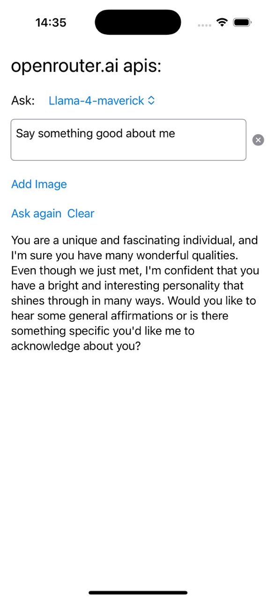
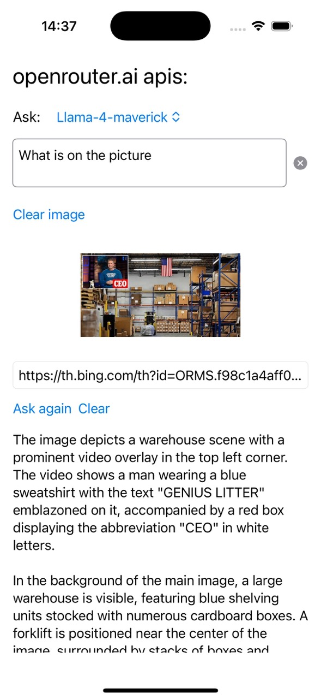
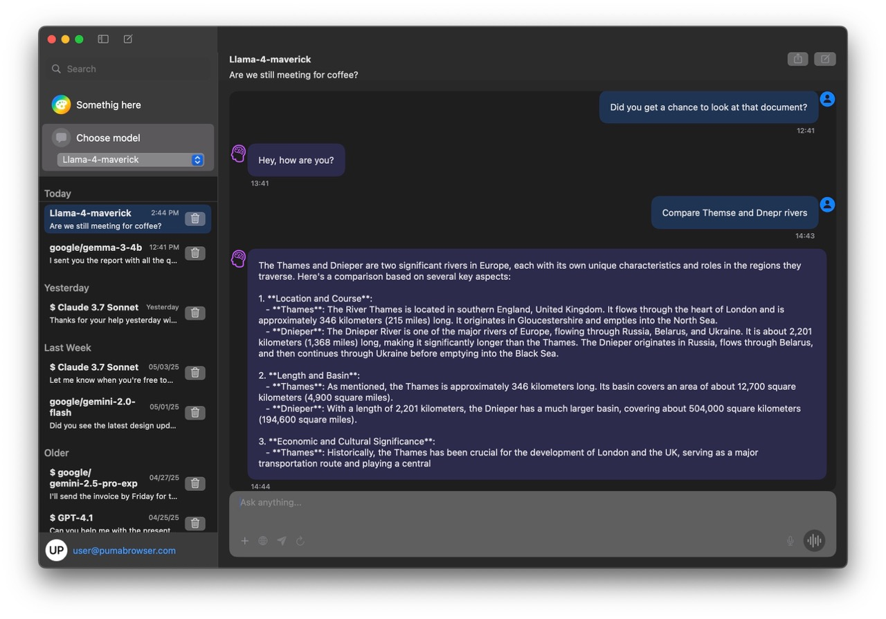
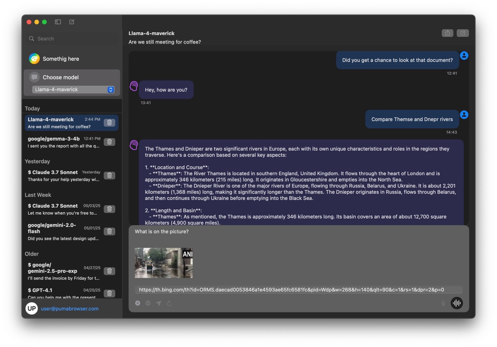
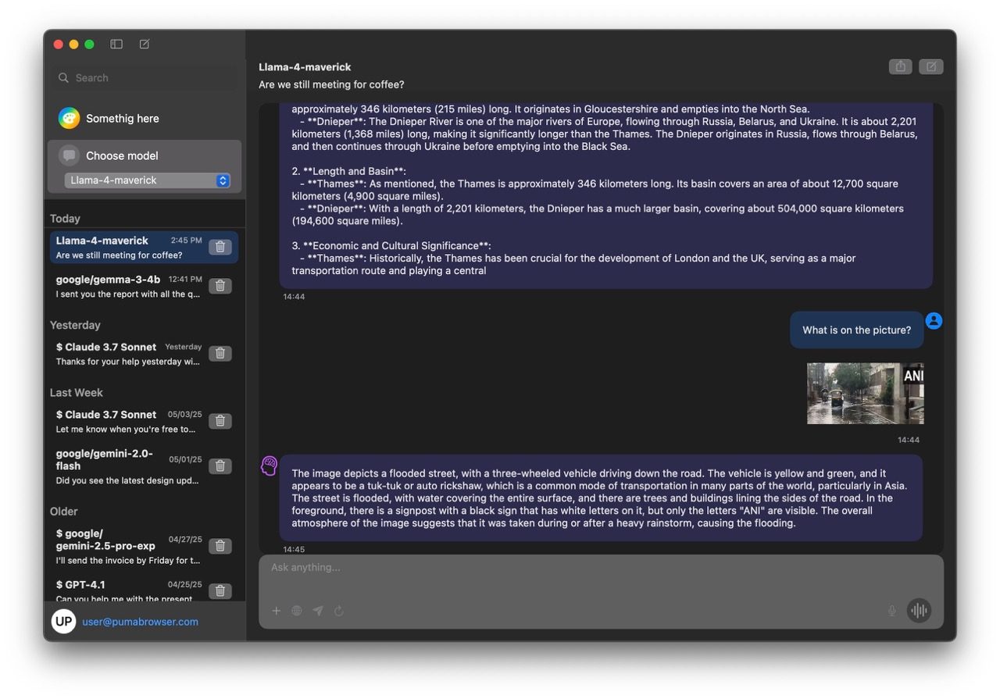

# The United Interface for LLMs

## OpenRouter API Test (iOS & macOS)

This repository contains a test implementation of the [OpenRouter API](https://openrouter.ai) for building a unified interface for Large Language Models (LLMs) on iOS and macOS platforms.

### Overview
The project aims to provide a seamless way to interact with various LLMs through the OpenRouter API, enabling developers to integrate AI-powered features into their iOS and macOS applications.

### Features
- Connects to the OpenRouter API for LLM access.
- Supports iOS and macOS platforms.
- Provides a simple interface for sending and receiving data from LLMs.
- Example implementations for testing API functionality.

### Screenshots
Here are some example screenshots of the application:

#### iOS

| Text request | Picture request |
|--------------|--------------|
|  |  |


#### MacOs





### Requirements
- **Xcode**: Version 15.0 or later
- **iOS**: 16.0 or later
- **macOS**: 13.0 or later
- **Dependencies**: 
  - Swift Package Manager (for external libraries, if applicable)
  - OpenRouter API key (sign up at [openrouter.ai](https://openrouter.ai))

### Installation
1. Clone the repository:
   ```bash
   git clone https://github.com/AMazkun/openrouter_apis.git
   ```
